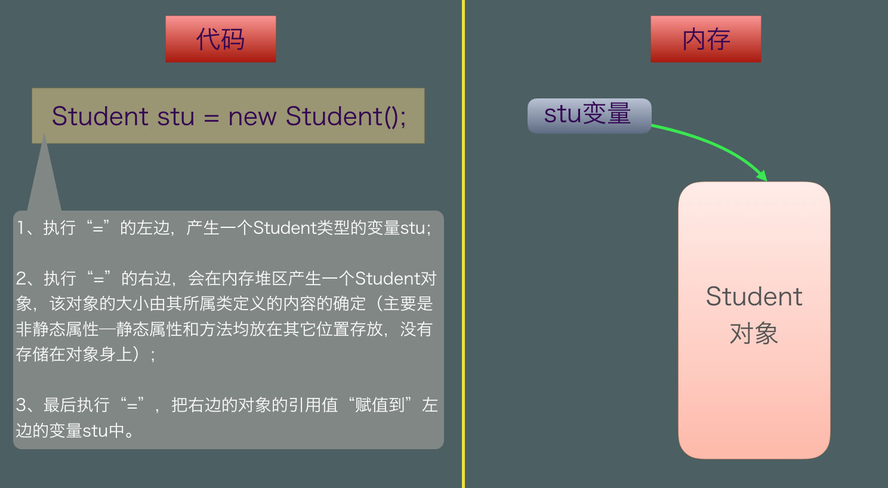

# Object Oriented

## 2. Java 面向对象

### 2.1. 类和对象

#### 2.1.1. 面向对象和面向过程的区别

- **面向过程** ：**面向过程性能比面向对象高。** 因为类调用时需要实例化，开销比较大，比较消耗资源，所以当性能是最重要的考量因素的时候，比如单片机、嵌入式开发、Linux/Unix 等一般采用面向过程开发。但是，**面向过程没有面向对象易维护、易复用、易扩展。**
- **面向对象** ：**面向对象易维护、易复用、易扩展。** 因为面向对象有封装、继承、多态性的特性，所以可以设计出低耦合的系统，使系统更加灵活、更加易于维护。但是，**面向对象性能比面向过程低**。

参见 issue : [面向过程 ：面向过程性能比面向对象高？？](https://github.com/Snailclimb/JavaGuide/issues/431)

> 这个并不是根本原因，面向过程也需要分配内存，计算内存偏移量，Java 性能差的主要原因并不是因为它是面向对象语言，而是 Java 是半编译语言，最终的执行代码并不是可以直接被 CPU 执行的二进制机械码。
>
> 而面向过程语言大多都是直接编译成机械码在电脑上执行，并且其它一些面向过程的脚本语言性能也并不一定比 Java 好。

#### 2.1.2. 构造器 Constructor 是否可被 override?

Constructor 不能被 override（重写）,但是可以 overload（重载）,所以你可以看到一个类中有多个构造函数的情况。

构造方法是用来产生对象的。如果通过重写拥有了构造方法，那么就可以控制对象的产生。


#### 2.1.3. 在 Java 中定义一个不做事且没有参数的构造方法的作用

Java 程序在执行子类的构造方法之前，如果没有用 `super()`来调用父类特定的构造方法，则会调用父类中“没有参数的构造方法”。因此，如果父类中只定义了有参数的构造方法，而在子类的构造方法中又没有用 `super()`来调用父类中特定的构造方法，则编译时将发生错误，因为 Java 程序在父类中找不到没有参数的构造方法可供执行。解决办法是在父类里加上一个不做事且没有参数的构造方法。

Java doesn't require a constructor when we create a class. However, it's important to know what happens under the hood when no constructors are explicitly defined. The compiler automatically provides a public no-argument constructor for any class without constructors. This is called the default constructor.

#### 2.1.4. 成员变量与局部变量的区别有哪些？

1. 从语法形式上看:成员变量是属于类的，而局部变量是在代码块或方法中定义的变量或是方法的参数；成员变量可以被 public,private,static 等修饰符所修饰，而局部变量不能被访问控制修饰符及 static 所修饰；但是，成员变量和局部变量都能被 final 所修饰。
2. 从变量在内存中的存储方式来看:如果成员变量是使用`static`修饰的，那么这个成员变量是属于类的，如果没有使用`static`修饰，这个成员变量是属于实例的。而对象存在于堆内存，局部变量则存在于栈内存。
3. 从变量在内存中的生存时间上看:成员变量是对象的一部分，它随着对象的创建而存在，而局部变量随着方法的调用而自动消失。
4. 成员变量如果没有被赋初值:则会自动以类型的默认值而赋值（一种情况例外:被 final 修饰的成员变量也必须显式地赋值），而局部变量则不会自动赋值。

#### 2.1.5. 创建一个对象用什么运算符?对象实体与对象引用有何不同?

new 运算符，new 创建对象实例（对象实例在堆内存中），对象引用指向对象实例（对象引用存放在栈内存中）。一个对象引用可以指向 0 个或 1 个对象（一根绳子可以不系气球，也可以系一个气球）;一个对象可以有 n 个引用指向它（可以用 n 条绳子系住一个气球）。

#### 2.1.6. 一个类的构造方法的作用是什么? 若一个类没有声明构造方法，该程序能正确执行吗? 为什么?

主要作用是完成对类对象的初始化工作。可以执行。因为一个类即使没有声明构造方法也会有默认的不带参数的构造方法。如果我们自己添加了类的构造方法（无论是否有参），Java 就不会再添加默认的无参数的构造方法了，这时候，就不能直接 new 一个对象而不传递参数了，所以我们一直在不知不觉地使用构造方法，这也是为什么我们在创建对象的时候后面要加一个括号（因为要调用无参的构造方法）。如果我们重载了有参的构造方法，记得都要把无参的构造方法也写出来（无论是否用到），因为这可以帮助我们在创建对象的时候少踩坑。

#### 2.1.7. 构造方法有哪些特性？

1. 名字与类名相同。
2. 没有返回值，但不能用 void 声明构造函数。
3. 生成类的对象时自动执行，无需调用。

#### 2.1.8. 在调用子类构造方法之前会先调用父类没有参数的构造方法,其目的是?

帮助子类做初始化工作。

#### 2.1.9. 对象的相等与指向他们的引用相等,两者有什么不同?

对象的相等，比的是内存中存放的内容是否相等。而引用相等，比较的是他们指向的内存地址是否相等。

### 2.2. 面向对象三大特征

#### 2.2.1. 封装

封装是指把一个对象的状态信息（也就是属性）隐藏在对象内部，不允许外部对象直接访问对象的内部信息。但是可以提供一些可以被外界访问的方法来操作属性。就好像我们看不到挂在墙上的空调的内部的零件信息（也就是属性），但是可以通过遥控器（方法）来控制空调。如果属性不想被外界访问，我们大可不必提供方法给外界访问。但是如果一个类没有提供给外界访问的方法，那么这个类也没有什么意义了。就好像如果没有空调遥控器，那么我们就无法操控空凋制冷，空调本身就没有意义了（当然现在还有很多其他方法 ，这里只是为了举例子）。

```java
public class Student {
    private int id;//id属性私有化
    private String name;//name属性私有化

    //获取id的方法
    public int getId() {
        return id;
    }

    //设置id的方法
    public void setId(int id) {
        this.id = id;
    }

    //获取name的方法
    public String getName() {
        return name;
    }

    //设置name的方法
    public void setName(String name) {
        this.name = name;
    }
}
```

#### 2.2.2. 继承

不同类型的对象，相互之间经常有一定数量的共同点。例如，小明同学、小红同学、小李同学，都共享学生的特性（班级、学号等）。同时，每一个对象还定义了额外的特性使得他们与众不同。例如小明的数学比较好，小红的性格惹人喜爱；小李的力气比较大。继承是使用已存在的类的定义作为基础建立新类的技术，新类的定义可以增加新的数据或新的功能，也可以用父类的功能，但不能选择性地继承父类。通过使用继承，可以快速地创建新的类，可以提高代码的重用，程序的可维护性，节省大量创建新类的时间 ，提高我们的开发效率。

**关于继承如下 3 点请记住：**

1. 子类拥有父类对象所有的属性和方法（包括私有属性和私有方法），但是父类中的私有属性和方法子类是无法访问，**只是拥有**。
2. 子类可以拥有自己属性和方法，即子类可以对父类进行扩展。
3. 子类可以用自己的方式实现父类的方法。（以后介绍）。

1. **继承**： 所谓继承就是把共有的数据项和行为抽取到父类中，这样所有子类都会自动具备，从而达到复用性。
	- java.lang.Object
	Class Object is the root of the class hierarchy. Every class has Object as a superclass. All objects, including arrays, implement the methods of this class. 
	- extends
	在子类基础上，继承新的父类，增加了新的属性和行为，或修改继承来的行为，但是属性不能改。
	- 单继承
	Java 中一个子类只能继承一个父类，为了避免多个父类拥有同样的特征，也避免了继承结构的复杂化。


```java
public class SuperClass{
    public SuperClass(){
        System.out.println("父类构造方法");
    }
}
public class SubClass extends SuperClass{
    public SubClass(){
        System.out.println("子类构造方法");
    }
}
public class Test{
    public static void main(String[] args){
        SubClass sub = new SubClass();
    }
}
```

无论有多少层的继承，其中心思想都是如此。比如：A类继承B类，B类继承C类，C类继承Object；那么new A()的时候也是先产生Object对象，再叠加上C类定义的部分，再叠加B类定义的部分，再叠加A类定义的部分，最后构成一个完整的A对象。这样A对象中既有自己的内容，也有继承树上各层父类的内容，这才形成最终继承的效果！


**构造方法**
父类的构造方法不会被子类继承！
第一：构造方法语法上要求方法名必须和类名保持一致。所以如果子类继承了父类的构造方法，那么很明显两个语法就冲突了（父类构造方法的名字肯定是父类名，必然和子类名不一样）。
第二：构造方法是用来产生对象的。如果子类通过继承拥有了父类的构造方法，那么子类可以控制父类对象的产生？这也是违背场景的。

构造方法不能被重写！
这就不多说了，子类没有继承父类的构造方法，当然也不可能对父类构造进行重写实现了 ‍♂️。

构造方法的作用就是在产生对象的时候，利用内存叠加实现继承机制。

this()与super()


属性
父类的属性会被子类继承，无论访问修饰符！
在继承机制中已经讲过，产生子类对象会先产生父类对象部分，然后叠加子类特有部分，从而构成完整子类对象。所以父类的属性都会放入到父类对象部分，那么也就在完整子类对象中。

父类的private属性会被继承，但无法访问！
private修饰符其本意为：私有。父类如果把该属性定义为了private，即意味着该属性只能让父类自己在内部直接访问；而子类从语意上就不应该能够访问它（没有得到父类的允许）。场景上，你爸的钱是拿给你继承的，但是他老人家不允许你直接用，你小子就是用不了 。

子类可以拥有和父类同名属性，不会发生覆盖。
```
public class SuperClass{
    public int num = 10;
}
public class SubClass extends SuperClass{
    public String num = "hello";
}
```
此时，在SubClass类的对象身上会有两个叫num的属性。来自父类的存放在父类对象部分，来自子类的存放在子类特有部分。这个时候如果用子类引用调用num属性，是操作的子类中的字符串num；用父类引用调用num属性，操作的是从父类继承而来的整型num。
```
public class Test{
    public static void main(String[] args){
        SubClass sub = new SubClass();//子类引用指向子类对象
        System.out.println(sub.num);//打印：hello
        SuperClass sup = (SuperClass)sub;//父类引用指向同一个子类对象
        System.out.println(sup.num);//打印：10
    }
}
```
只new了一次，在对象没有变仅仅是引用变化的情况下，很明显看到了两个属性的共存。
⚠️这种父类和子类各拥有一个同名属性的情况往往只发生在面试中。在真实场景中，如果是同一个属性，那么子类没有必要再定义一次；如果是两个属性，就应该把名字区分开。


方法
父类的方法会被子类继承，无论访问修饰符！

父类的private方法会被继承，但无法访问！
这两点与上面属性的效果一致，所以不再累述。

子类可以拥有和父类同名方法，符合重写规范的话会发生覆盖。
方法重写的规范包括：

1. 方法名相同；
2. 参数列表相同（包括参数个数、类型、顺序三者都相同）；
3. 返回类型相同；
4. 子类方法的访问修饰符不能小于父类方法的访问修饰符；
5. 子类方法的方法声明不能比父类方法的方法声明抛出更多的异常。

只有这5点均满足的情况下，才会发生重写；否则会报错或两个方法共存（重载）。

this.与super.
通过这个对比我们可以看到，凡是用super能够操作到的属性或行为，this一定能够操作；而用this能够操作到的，super却不一定能够操作到；所以尽可能在代码中使用this来进行调用。
那么，什么时候使用super.操作呢？就是在调用重写方法的时候，this.重写方法()得到的是重写后的效果（即子类中定义的效果）；用super.重写方法()得到的是重写前的效果(即父类中定义的效果)。

final
final这个关键字的含义为：最终的、不变的。
用final修饰的变量，由于赋予了不变的特性，所以就只能为常量了；
> 如果引用为基本数据类型，则该引用为常量，该值无法修改；
  如果引用为引用数据类型，比如对象、数组，则该对象、数组本身可以修改，但指向该对象或数组的地址的引用不能修改。
  如果引用是类的成员变量，则必须当场赋值，否则编译会报错。

用final修饰的方法，同样由于赋予不变特性，所以子类就不能再重写该方法了；但是，该方法仍然可以被继承。
用final修饰的类，是给这个类赋予不变特性，所以这个类不能再生成子类（子类完全可以看成是对父类的扩展和变化）。
思考一下：为啥final不能修饰构造方法呢❓


多态：

其本质是子类通过覆盖或重载父类的方法，来使得对同一类对象同一方法的调用产生不同的结果。

#### 2.2.3. 多态

多态，顾名思义，表示一个对象具有多种的状态。具体表现为父类的引用指向子类的实例。

**多态的特点:**

- 对象类型和引用类型之间具有继承（类）/实现（接口）的关系；
- 引用类型变量发出的方法调用的到底是哪个类中的方法，必须在程序运行期间才能确定；
- 多态不能调用“只在子类存在但在父类不存在”的方法；
- 如果子类重写了父类的方法，真正执行的是子类覆盖的方法，如果子类没有覆盖父类的方法，执行的是父类的方法。

### 2.3. 修饰符

#### 2.3.1. 在一个静态方法内调用一个非静态成员为什么是非法的?

由于静态方法可以不通过对象进行调用，因此在静态方法里，不能调用其他非静态变量，也不可以访问非静态变量成员。

#### 2.3.2. 静态方法和实例方法有何不同

1. 在外部调用静态方法时，可以使用"类名.方法名"的方式，也可以使用"对象名.方法名"的方式。而实例方法只有后面这种方式。也就是说，调用静态方法可以无需创建对象。

2. 静态方法在访问本类的成员时，只允许访问静态成员（即静态成员变量和静态方法），而不允许访问实例成员变量和实例方法；实例方法则无此限制。

### 2.5. 其它重要知识点

#### 2.5.1. String StringBuffer 和 StringBuilder 的区别是什么? String 为什么是不可变的?

简单的来说：`String` 类中使用 final 关键字修饰字符数组来保存字符串，`private final char value[]`，所以`String` 对象是不可变的。

> 补充（来自[issue 675](https://github.com/Snailclimb/JavaGuide/issues/675)）：在 Java 9 之后，String 类的实现改用 byte 数组存储字符串 `private final byte[] value`;

而 `StringBuilder` 与 `StringBuffer` 都继承自 `AbstractStringBuilder` 类，在 `AbstractStringBuilder` 中也是使用字符数组保存字符串`char[]value` 但是没有用 `final` 关键字修饰，所以这两种对象都是可变的。

`StringBuilder` 与 `StringBuffer` 的构造方法都是调用父类构造方法也就是`AbstractStringBuilder` 实现的，大家可以自行查阅源码。

`AbstractStringBuilder.java`

```java
abstract class AbstractStringBuilder implements Appendable, CharSequence {
    /**
     * The value is used for character storage.
     */
    char[] value;

    /**
     * The count is the number of characters used.
     */
    int count;

    AbstractStringBuilder(int capacity) {
        value = new char[capacity];
    }}
```

**线程安全性**

`String` 中的对象是不可变的，也就可以理解为常量，线程安全。`AbstractStringBuilder` 是 `StringBuilder` 与 `StringBuffer` 的公共父类，定义了一些字符串的基本操作，如 `expandCapacity`、`append`、`insert`、`indexOf` 等公共方法。`StringBuffer` 对方法加了同步锁或者对调用的方法加了同步锁，所以是线程安全的。`StringBuilder` 并没有对方法进行加同步锁，所以是非线程安全的。

**性能**

每次对 `String` 类型进行改变的时候，都会生成一个新的 `String` 对象，然后将指针指向新的 `String` 对象。`StringBuffer` 每次都会对 `StringBuffer` 对象本身进行操作，而不是生成新的对象并改变对象引用。相同情况下使用 `StringBuilder` 相比使用 `StringBuffer` 仅能获得 10%~15% 左右的性能提升，但却要冒多线程不安全的风险。

**对于三者使用的总结：**

1. 操作少量的数据: 适用 `String`
2. 单线程操作字符串缓冲区下操作大量数据: 适用 `StringBuilder`
3. 多线程操作字符串缓冲区下操作大量数据: 适用 `StringBuffer`

#### 2.5.2. Object 类的常见方法总结

Object 类是一个特殊的类，是所有类的父类。它主要提供了以下 11 个方法：

```java

public final native Class<?> getClass()//native方法，用于返回当前运行时对象的Class对象，使用了final关键字修饰，故不允许子类重写。

public native int hashCode() //native方法，用于返回对象的哈希码，主要使用在哈希表中，比如JDK中的HashMap。
public boolean equals(Object obj)//用于比较2个对象的内存地址是否相等，String类对该方法进行了重写用户比较字符串的值是否相等。

protected native Object clone() throws CloneNotSupportedException//naitive方法，用于创建并返回当前对象的一份拷贝。一般情况下，对于任何对象 x，表达式 x.clone() != x 为true，x.clone().getClass() == x.getClass() 为true。Object本身没有实现Cloneable接口，所以不重写clone方法并且进行调用的话会发生CloneNotSupportedException异常。

public String toString()//返回类的名字@实例的哈希码的16进制的字符串。建议Object所有的子类都重写这个方法。

public final native void notify()//native方法，并且不能重写。唤醒一个在此对象监视器上等待的线程(监视器相当于就是锁的概念)。如果有多个线程在等待只会任意唤醒一个。

public final native void notifyAll()//native方法，并且不能重写。跟notify一样，唯一的区别就是会唤醒在此对象监视器上等待的所有线程，而不是一个线程。

public final native void wait(long timeout) throws InterruptedException//native方法，并且不能重写。暂停线程的执行。注意：sleep方法没有释放锁，而wait方法释放了锁 。timeout是等待时间。

public final void wait(long timeout, int nanos) throws InterruptedException//多了nanos参数，这个参数表示额外时间（以毫微秒为单位，范围是 0-999999）。 所以超时的时间还需要加上nanos毫秒。

public final void wait() throws InterruptedException//跟之前的2个wait方法一样，只不过该方法一直等待，没有超时时间这个概念

protected void finalize() throws Throwable { }//实例被垃圾回收器回收的时候触发的操作

```

#### 2.5.3. == 与 equals(重要)

**==** : 它的作用是判断两个对象的地址是不是相等。即，判断两个对象是不是同一个对象(基本数据类型==比较的是值，引用数据类型==比较的是内存地址)。

**equals()** : 它的作用也是判断两个对象是否相等。但它一般有两种使用情况：

- 情况 1：类没有覆盖 equals() 方法。则通过 equals() 比较该类的两个对象时，等价于通过“==”比较这两个对象。
- 情况 2：类覆盖了 equals() 方法。一般，我们都覆盖 equals() 方法来比较两个对象的内容是否相等；若它们的内容相等，则返回 true (即，认为这两个对象相等)。

**举个例子：**

```java
public class test1 {
    public static void main(String[] args) {
        String a = new String("ab"); // a 为一个引用
        String b = new String("ab"); // b为另一个引用,对象的内容一样
        String aa = "ab"; // 放在常量池中
        String bb = "ab"; // 从常量池中查找
        if (aa == bb) // true
            System.out.println("aa==bb");
        if (a == b) // false，非同一对象
            System.out.println("a==b");
        if (a.equals(b)) // true
            System.out.println("aEQb");
        if (42 == 42.0) { // true
            System.out.println("true");
        }
    }
}
```

**说明：**

- String 中的 equals 方法是被重写过的，因为 object 的 equals 方法是比较的对象的内存地址，而 String 的 equals 方法比较的是对象的值。
- 当创建 String 类型的对象时，虚拟机会在常量池中查找有没有已经存在的值和要创建的值相同的对象，如果有就把它赋给当前引用。如果没有就在常量池中重新创建一个 String 对象。

#### 2.5.4. hashCode 与 equals (重要)

面试官可能会问你：“你重写过 hashcode 和 equals 么，为什么重写 equals 时必须重写 hashCode 方法？”

##### 2.5.4.1. hashCode（）介绍

hashCode() 的作用是获取哈希码，也称为散列码；它实际上是返回一个 int 整数。这个哈希码的作用是确定该对象在哈希表中的索引位置。hashCode() 定义在 JDK 的 Object.java 中，这就意味着 Java 中的任何类都包含有 hashCode() 函数。

散列表存储的是键值对(key-value)，它的特点是：能根据“键”快速的检索出对应的“值”。这其中就利用到了散列码！（可以快速找到所需要的对象）

##### 2.5.4.2. 为什么要有 hashCode

**我们先以“HashSet 如何检查重复”为例子来说明为什么要有 hashCode：** 当你把对象加入 HashSet 时，HashSet 会先计算对象的 hashcode 值来判断对象加入的位置，同时也会与该位置其他已经加入的对象的 hashcode 值作比较，如果没有相符的 hashcode，HashSet 会假设对象没有重复出现。但是如果发现有相同 hashcode 值的对象，这时会调用 `equals()`方法来检查 hashcode 相等的对象是否真的相同。如果两者相同，HashSet 就不会让其加入操作成功。如果不同的话，就会重新散列到其他位置。（摘自我的 Java 启蒙书《Head first java》第二版）。这样我们就大大减少了 equals 的次数，相应就大大提高了执行速度。

通过我们可以看出：`hashCode()` 的作用就是**获取哈希码**，也称为散列码；它实际上是返回一个 int 整数。这个**哈希码的作用**是确定该对象在哈希表中的索引位置。**`hashCode()`在散列表中才有用，在其它情况下没用**。在散列表中 hashCode() 的作用是获取对象的散列码，进而确定该对象在散列表中的位置。

##### 2.5.4.3. hashCode（）与 equals（）的相关规定

1. 如果两个对象相等，则 hashcode 一定也是相同的
2. 两个对象相等,对两个对象分别调用 equals 方法都返回 true
3. 两个对象有相同的 hashcode 值，它们也不一定是相等的
4. **因此，equals 方法被覆盖过，则 hashCode 方法也必须被覆盖**
5. hashCode() 的默认行为是对堆上的对象产生独特值。如果没有重写 hashCode()，则该 class 的两个对象无论如何都不会相等（即使这两个对象指向相同的数据）

推荐阅读：[Java hashCode() 和 equals()的若干问题解答](https://www.cnblogs.com/skywang12345/p/3324958.html)

#### 2.5.5. Java 序列化中如果有些字段不想进行序列化，怎么办？

对于不想进行序列化的变量，使用 transient 关键字修饰。

transient 关键字的作用是：阻止实例中那些用此关键字修饰的的变量序列化；当对象被反序列化时，被 transient 修饰的变量值不会被持久化和恢复。transient 只能修饰变量，不能修饰类和方法。

#### 2.5.6. 获取用键盘输入常用的两种方法

方法 1：通过 Scanner

```java
Scanner input = new Scanner(System.in);
String s  = input.nextLine();
input.close();
```

方法 2：通过 BufferedReader

```java
BufferedReader input = new BufferedReader(new InputStreamReader(System.in));
String s = input.readLine();
```
