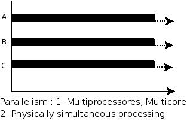

### 并发与并行的区别


来个比喻：并发是一个人同时吃三个馒头，而并行是三个人同时吃三个馒头。

并发是指一个处理器同时处理多个任务。


并行是指多个处理器或者是多核的处理器同时处理多个不同的任务。



### 进程的创建

操作系统需要一些方式创建进程。下面是一些创建方式：
- 系统初始化 （守护进程daemons）
- 正在运行的程序执行了创建进程的系统调用（fork）
- 用户请求创建一个新的进程 
- 初始化一个批量工作 （Shell）

##### fork

一个进程，包括代码、数据和分配给进程的资源。fork()函数通过系统调用创建一个与原来进程几乎完全相同的进程，也就是两个进程可以做完全相同的事，但如果初始参数或者传入的变量不同，两个进程也可以做不同的事。
一个进程调用fork()函数后，系统先给新的进程分配资源，例如存储数据和代码的空间。然后把原来的进程的所有值都复制到新的新进程中，只有少数值与原来的进程的值不同。相当于克隆了一个自己。

fork调用的一个奇妙之处就是它仅仅被调用一次，却能够返回两次，它可能有三种不同的返回值：
- 1）在父进程中，fork返回新创建子进程的进程ID；
- 2）在子进程中，fork返回0；
- 3）如果出现错误，fork返回一个负值；
 
在fork函数执行完毕后，如果创建新进程成功，则出现两个进程，一个是子进程，一个是父进程。在子进程中，fork函数返回0，在父进程中，fork返回新创建子进程的进程ID。我们可以通过fork返回的值来判断当前进程是子进程还是父进程。

引用一位网友的话来解释fpid的值为什么在父子进程中不同。“其实就相当于链表，进程形成了链表，父进程的fpid(p 意味point)指向子进程的进程id, 因为子进程没有子进程，所以其fpid为0.
fork出错可能有两种原因：
1）当前的进程数已经达到了系统规定的上限，这时errno的值被设置为EAGAIN。
2）系统内存不足，这时errno的值被设置为ENOMEM。
```
  i  son/pa  ppid  pid   fpid
  0  parent  2043  3224  3225
  0  child   3224  3225     0
  1  parent  2043  3224  3226
  1  parent  3224  3225  3227
  1  child      1  3227     0
  1  child      1  3226     0 
```

当父进程自然死亡，就没有父进程了，这在操作系统是不被允许的，所以p3226，p3227的父进程就被置为p1了

执行printf函数的次数为2*（1+2+4+……+2^N-1）次，创建的子进程数为1+2+4+……+2^N-1个。